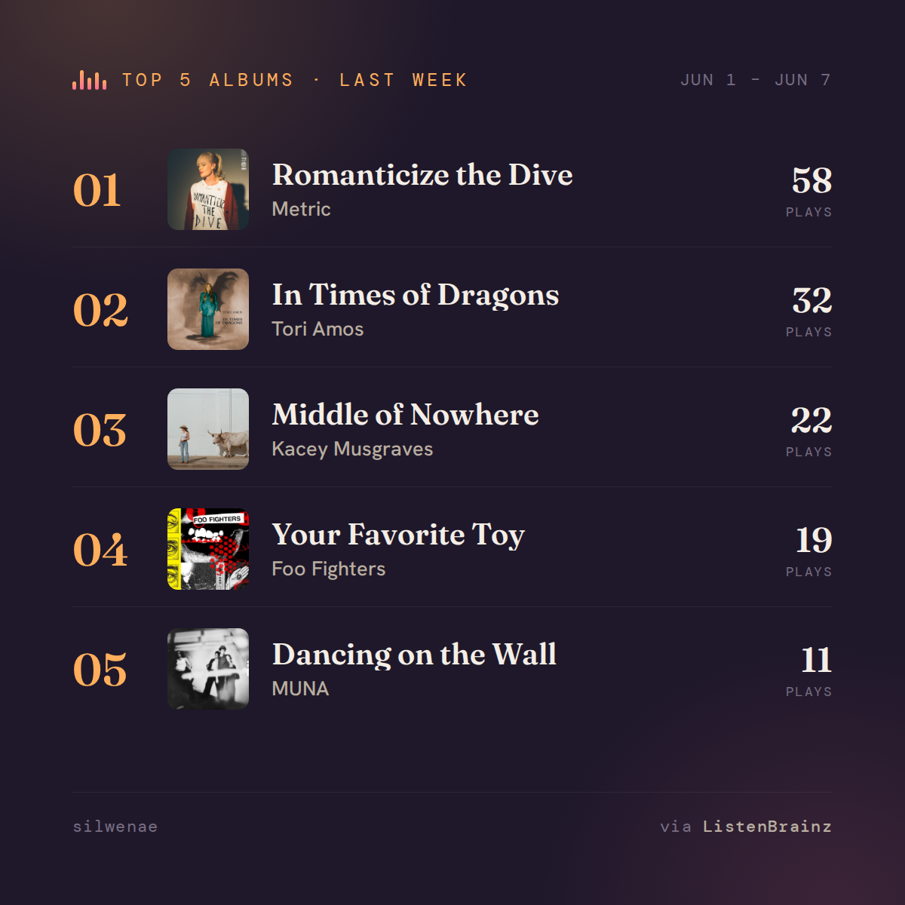

# ListenBrainz Autoposter

Posts your **ListenBrainz top 5 albums from last month** to **Bluesky and/or Mastodon**,
automatically, on the 4th of every month — running entirely on **GitHub Actions** (no Cloudflare, no
server to run).

Inspired by [scrobble-blue](https://github.com/willmanduffy/scrobble-blue), but rebuilt around
GitHub Actions + ListenBrainz instead of a Cloudflare Worker.



Also checkout my [ListenBrainz-widget](https://prcutler.github.io/listenbrainz-widget/index.html) to embed your top listens in a webpage or manually create an image you can share on the social media platform of your choice.

## How it works

- A scheduled GitHub Actions workflow runs **on the 4th of every month at 15:00 UTC**.
- It reads your **last completed calendar month** of listens from the public ListenBrainz
  statistics API (`range=month`).
- It renders a **1200×1200 image** of your top 5 albums (with cover art) using headless Chromium
  (Playwright), then posts it to Bluesky with a short caption and accessible alt text.
- If the image render ever fails, it automatically falls back to a **text-only** post.

### Why the 4th / why monthly instead of weekly?

This originally ran weekly (every Wednesday), reading ListenBrainz's `week` range. That fought their
[update schedule](https://listenbrainz.readthedocs.io/en/latest/general/data-update-intervals.html):
they only do a full stats reimport on the **1st and 15th of the month**. In June 2026 the `week`
range got stuck serving the same stale window for **8+ days** — `last_updated` on their API was
frozen the whole time, even though raw listens kept recording fine. No amount of schedule-shuffling
fixes a problem that's upstream, so the project moved to `range=month`, which only needs to flip over
once a month, right when ListenBrainz already does its full reimport. Posting on the **4th** gives a
few days of buffer after the 1st-of-month reimport.

That buffer helps with normal lag, but doesn't guarantee ListenBrainz's stats engine won't stall for
days at a *month* boundary the same way it did at a *week* boundary. So the script still checks how
old the returned month is and **skips posting** (rather than re-posting stale data) if it's more than
`STALE_AFTER_DAYS` (currently 15) days behind.

## Setup

### 1. Get credentials for at least one destination

You can post to **Bluesky, Mastodon, or both** — it posts to whichever you've configured.

**Bluesky:** Settings → **App Passwords → Add App Password**. Use this, not your real password (it's
revocable and works with MFA enabled).

**Mastodon:** your instance → **Preferences → Development → New Application**, with scopes
`write:statuses` and `write:media`, then copy the access token.

### 2. Push this project to a GitHub repo

```bash
cd listenbrainz-autoposter
git init && git add . && git commit -m "Initial commit"
git remote add origin git@github.com:<you>/listenbrainz-autoposter.git
git push -u origin main
```

### 3. Add repository secrets

In your repo: **Settings → Secrets and variables → Actions → New repository secret**. Add
`LISTENBRAINZ_USERNAME` plus the secrets for whichever destination(s) you want:

| Secret | Value | Needed for |
|---|---|---|
| `LISTENBRAINZ_USERNAME` | your ListenBrainz username (e.g. `silwenae`) | always |
| `BSKY_USERNAME` | your Bluesky handle (e.g. `you.bsky.social`) | Bluesky |
| `BSKY_PASSWORD` | the app password from step 1 | Bluesky |
| `MASTODON_INSTANCE` | your instance URL (e.g. `https://mastodon.social`) | Mastodon |
| `MASTODON_TOKEN` | the access token from step 1 | Mastodon |

Leave out the secrets for any platform you don't want to post to.

### 4. Test it

Go to the **Actions** tab → **Monthly ListenBrainz → Bluesky** → **Run workflow**, and tick
**dry run** to preview the post text in the logs without sending it. When you're happy, run it again
without dry run (or just wait for the 4th).

## Running locally

Requires **Node.js 20.6+** (for `--env-file`).

```bash
cp .env.example .env                  # fill in your details
npm install
npx playwright install chromium       # one-time: download the browser
npm run dry-run                       # prints the post + writes ./preview.png, does NOT send it
npm run local                         # actually posts to Bluesky
```

`npm run dry-run` saves the rendered card to `./preview.png` (or `.jpg`) so you can eyeball the image
before posting for real.

## What gets posted

A **1200×1200 image** of your top 5 albums with cover art, plus a short caption:

```
🎧 My top 5 artists on ListenBrainz last month (May 1 – May 31)

https://listenbrainz.org/user/silwenae/
```

The full ranked list (album — artist — play count) goes into the image's **alt text** for
accessibility. The same caption + image is sent to every configured destination; the profile link is
rendered as a clickable link on both Bluesky (via facets) and Mastodon (auto-linkified).

### Text-only mode

Set `TEXT_ONLY=1` to skip the image and post the full ranked list as text instead. The renderer also
falls back to text automatically if Chromium fails for any reason.

## Notes & ideas

- **Image size:** Bluesky caps image blobs at 1 MB. The card is screenshotted as PNG, and if that
  exceeds the limit it's re-encoded as JPEG automatically.
- **Top artists instead of albums?** ListenBrainz also exposes `/stats/user/{user}/artists`. Swap
  the endpoint in `src/listenbrainz.mjs` and the wording in `src/index.mjs` / `src/template.mjs`.
- **GitHub Actions cron is best-effort** and can run a few minutes late — fine for a monthly job, but
  not suitable for minute-by-minute tasks.

## Project layout

```
.github/workflows/monthly-post.yml  # the 4th-of-month schedule + manual trigger
src/index.mjs                       # orchestration + caption/alt text
src/listenbrainz.mjs                # ListenBrainz stats fetch + cover-art URLs
src/template.mjs                    # the 1200×1200 HTML card
src/image.mjs                       # Playwright render → PNG/JPEG buffer
src/bluesky.mjs                     # Bluesky login + post (with image embed)
src/mastodon.mjs                    # Mastodon media upload + status post
.env.example                        # local config template
```
